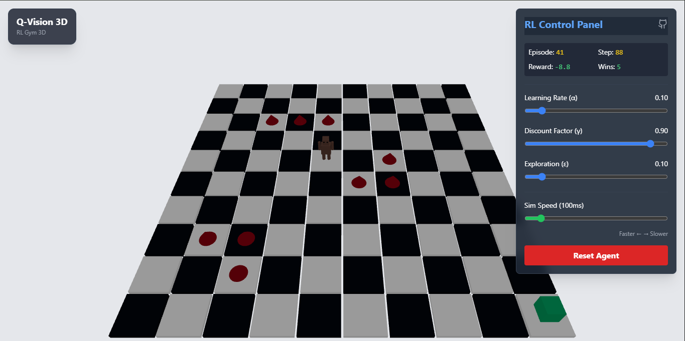
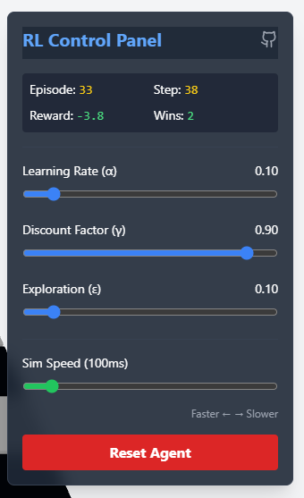

# Q-Vision 3D

**Q-Vision 3D** is an interactive 3D Reinforcement Learning (RL) environment designed to visualize and teach RL concepts. It features a custom-built 3D world where an intelligent agent learns to navigate a grid, avoid hazards, and reach goals.



## Features

-   **Interactive 3D World**: Built with React Three Fiber, featuring a high-contrast chessboard grid and professional lighting.
-   **Custom Agent**: A unique "Wooden Robot" agent constructed from geometric primitives.  
-   **Q-Learning Visualization**: Watch the agent learn and explore its environment in real-time.
-   **Modern Aesthetic**: A clean, neutral design with a focus on clarity and professionalism.

## Controls



The dashboard provides real-time control over the Q-Learning algorithm and the simulation:

-   **Learning Rate ($\alpha$)**: Determines to what extent newly acquired information overrides old information. A factor of 0 makes the agent learn nothing (exclusively exploiting prior knowledge), while a factor of 1 makes the agent consider only the most recent information (ignoring prior knowledge).
-   **Discount Factor ($\gamma$)**: Determines the importance of future rewards. A factor of 0 makes the agent "myopic" (or short-sighted) by only considering current rewards, while a factor approaching 1 will make it strive for a long-term high reward.
-   **Exploration ($\epsilon$)**: Controls the trade-off between exploration and exploitation. A higher value means the agent is more likely to choose a random action to explore the environment, while a lower value means it will exploit its current knowledge.
-   **Sim Speed**: Adjusts the speed of the simulation. Drag left for faster execution, right for slower observation.
-   **Reset Agent**: Resets the agent's position and clears its learned Q-table, starting the learning process from scratch.

## Getting Started

1.  Install dependencies:
    ```bash
    npm install
    ```

2.  Run the development server:
    ```bash
    npm run dev
    ```

3.  Open your browser to the local server (usually `http://localhost:5173`).

## Technologies

-   React
-   TypeScript
-   Three.js (@react-three/fiber, @react-three/drei)
-   Vite
-   Tailwind CSS
