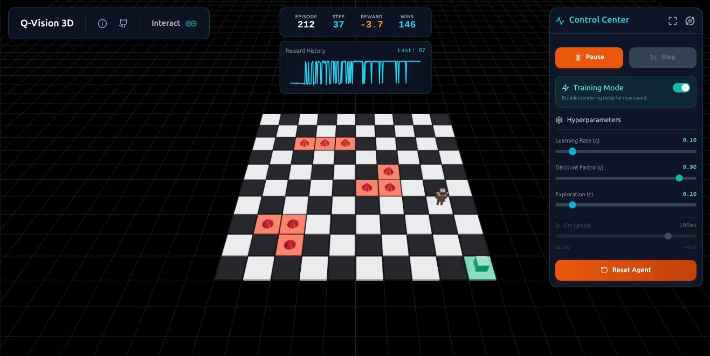

# Q-Vision 3D

**Q-Vision 3D** is an interactive 3D Reinforcement Learning (RL) environment designed to visualize and teach RL concepts. It features a custom-built 3D world where an intelligent agent learns to navigate a grid, avoid hazards, and reach goals.

## Features

-   **Interactive 3D World**: Built with React Three Fiber, featuring a high-contrast chessboard grid and professional lighting.
-   **Custom Agent**: A unique "Wooden Robot" agent constructed from geometric primitives.  
-   **Q-Learning Visualization**: Watch the agent learn and explore its environment in real-time.
-   **Modern Aesthetic**: A clean, neutral design with a focus on clarity and professionalism.

## Controls

The Control Center dashboard provides real-time control over the Q-Learning algorithm and simulation:

### Action Controls
-   **Pause/Resume**: Pause or resume the simulation
-   **Step**: Execute a single step when paused (for detailed observation)
-   **Reset Agent**: Resets the agent's position and clears its learned Q-table, starting the learning process from scratch

### Hyperparameters
-   **Learning Rate (α)**: How much new information overrides old (0-1). Higher = faster learning but less stable
-   **Discount Factor (γ)**: Importance of future rewards (0-1). Higher = more long-term planning
-   **Exploration (ε)**: Probability of random actions (0-1). Higher = more exploration vs exploitation
-   **Simulation Speed**: Delay between steps in milliseconds (10-500ms). Drag right for faster execution, left for slower observation

### Advanced Features
-   **Training Mode**: Disables rendering delay to maximize learning speed. Useful for rapid convergence to optimal policy
-   **Stats Display**: Real-time episode count, step count, cumulative reward, and win count
-   **Reward History Chart**: Visual graph of reward progression over episodes

### 3D View Controls
-   **Rotate**: Click and drag to rotate the camera
-   **Zoom**: Scroll wheel to zoom in/out
-   **Pan**: Right-click and drag to pan the view

## Why this Project?

I built this project to better understand Reinforcement Learning (RL). It serves as a practical playground for visualizing how agents learn to make decisions in an environment.

This project is excellent for anyone interested in:
-   **Robotics**: Understanding how robots perceive and navigate the world.
-   **Self-Driving Cars**: Learning the foundational concepts behind autonomous vehicle decision-making.
-   **Game AI**: Seeing how computer players (like in Chess or Go) learn strategies and optimize their gameplay.

---

> "Have you been productive today?"
